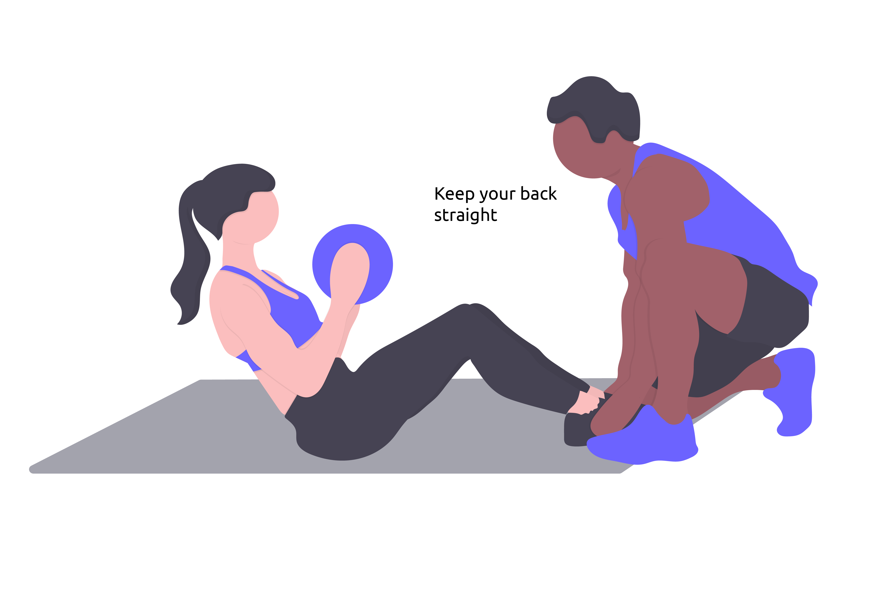
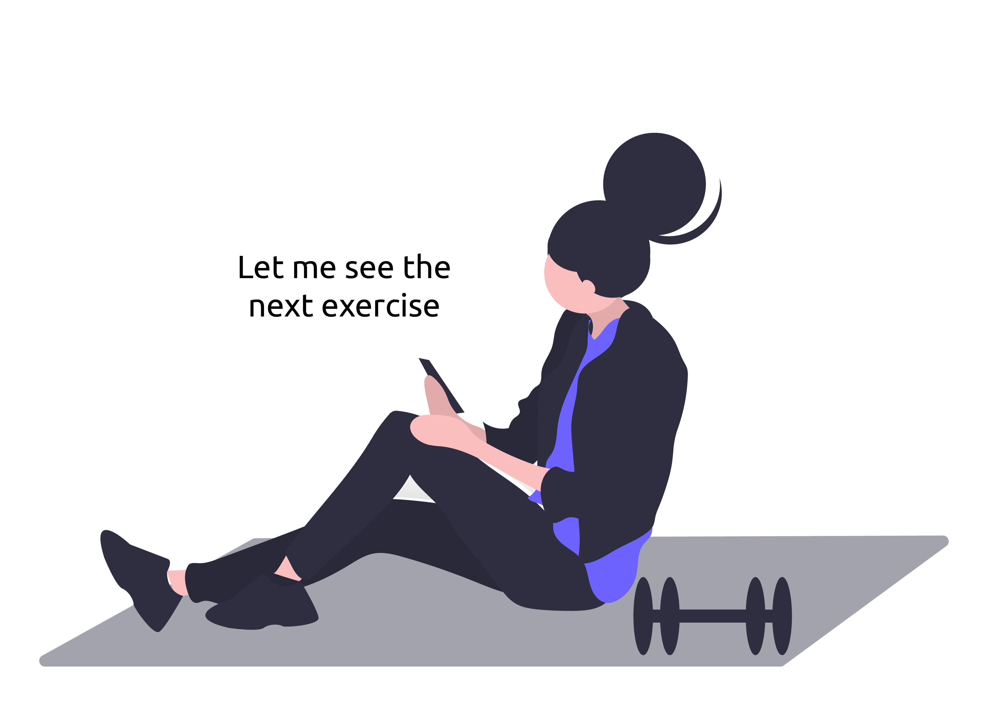
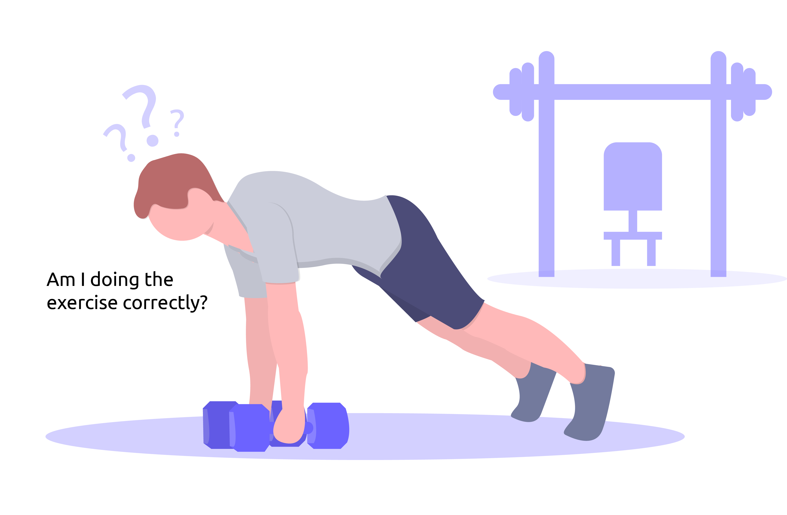

# Milestone 1: Project description and Needfinding - gymMe5

## Overview and planning

We want to investigate the execution of a workout session of a gym user and his relationship with the Personal Trainer (PT). More specifically, we want to discover how gym users follow their training schedule, if they follow one. For this purpose we selected unexperienced clients on an age range that goes from 18 to 35 y.o. that started to go to the gym recently but also more experienced clients that have reached some training goals. We decided also to include the Personal Trainer in the observations to have the perspective of a professional figure. This research is releated to the original project idea since we try to find out if there are critical issues during the gym experience.

## Observation

### NOTE:

We realized all the illustrations through the use of svg files edited on [ Adobe Illustrator](https://www.adobe.com/it/products/illustrator.html?mv=search&mv=search&sdid=KCJMVLF6&ef_id=Cj0KCQiAk4aOBhCTARIsAFWFP9FEsioJEFXhtGruZvMUxE3OS2isGnYMcESGr3As7RVJl4QBAewXIbIaAmxcEALw_wcB:G:s&s_kwcid=AL!3085!3!340618301694!e!!g!!adobe%20illustrator!1478761148!58366715478&gclid=Cj0KCQiAk4aOBhCTARIsAFWFP9FEsioJEFXhtGruZvMUxE3OS2isGnYMcESGr3As7RVJl4QBAewXIbIaAmxcEALw_wcB) to accurately depict what we saw during the observations. We didn't take pictures to preserve people's privacy.

### 1st person observed: Personal trainer (PT)

We conducted the forst observation in the late morning, the gym room wasn't crowded. The PT was sitting in a chair in a corner of the room waiting for clients to ask him for help. After few minutes a client went to the PT asking for help. She was holding her paper traning card, it looked wrinkled and battered. She showed to the PT an exercise on the traning card and the PT tried to read the contents of the card for a while; probably the words, given the condition of the training card, were hardly legible. Then, he walked her to the gym mats. He asked to the client to bring him a weight and then he sat on the mat. He started to perform the exercise really slowly, specifying to the client what she needed to pay attention to (the position of the back during the esecution) in order not to get injured. After that he asked to the client to show him her own esecution of the exercise. She made two repetitions and after that the PT said that the esecution was ok and he returned to his chair, where other clients were waiting for his help. Due to what had happened with the paper training card, we started looking for the place where they were retained. Next to the entrance door we found two containers, they looked messy and disorganized; many of the training cards within were poorly folded and ruined. 

### 2nd person observed: gym user 1

We started the second observation at a different gym, and chose to observe the last 20 minutes of training of a gym user. There were many users in the gym room, resulting in a quite noisy and crowded place.
The user we chose to observe was about 25 years old, she was doing bodyweight exercises and did not looked like a novice in the gym, she was executing a plank exercise very well.
After three repetitions of that exercise, she consulted a training schedule on her smartphone.
She consulted her training schedule every time she had to change exercise, so she used her phone a lot.
She workout for 10 minutes doing two different exercises and for each one she set the timer on her phone to monitor her rest phase and workout phase.
During the whole observation she did not have any contact with the personal trainer and never asked for help.
She spent the last 10 minutes doing stretching exercises without setting any timer and without consulting her smartphone at all.
At the end of the observation, before starting the interview, she went in front of the mirror and spent few time looking herself.

### 3rd person observed: gym user 2

We conducted the observation in a rush hour (20:00 on Wednesday) at the gym, indeed the room was really crowed. The third person observed was a guy, about 30 years old, he started the training with 10 minutes of tapis roulant and after that he walked to the place where weights are placed. He started to do his first exercise by lifting the weights but he didn't consult any training card (neither on paper or on the smartphone). He did serveral series of the exercise, waiting for the stop time between two series without checking a timer. After that he proceeded to do another exercise with some weights and a gym mat, once again he didn't check any training card. The execution of this exercise in particular was very raw and the posture of the client seemed wrong.

## Interviews

Questions for the PT:

  - _General information about the PT:_

    1. How long have you been a PT?
    2. How many people are you currently following?
    3. How many of these people had no previous experience?

  - _PT Job Information:_

    4. What is the activity that takes you the most time?
    5. What information do you need when introducing a new subscriber and how do you get it?
    6. How do you follow a new member on their initial journey?
    7. How do you track a client's progress?
    8. What do you think can be improved in supporting a member from his first day in the gym to achieving a goal? (improve the quality of service and results)
    9. Have you thought of any other information to give us?

Questions for the gym users:

 - _General user information:_

    1. Why did you join the gym and what are your goals?
    2. How long have you been in the gym and what level of experience do you have?
    3. How consistently do you train and how many times a week?

 - _Information on user activity:_

    4. How were you welcomed in the gym? How did you receive your first training program and how were you coached during the first executions of the exercises?
    5. How do you consult the card during training?
    6. When you train, how convinced are you that you are doing the exercise correctly and with the right intensity?
    7. Have you ever suffered injuries due to incorrect execution of the exercises? What do you do to prevent it from happening again?
    8. How do you track your training and progress?
    9. Do you have a precise idea of the time required to achieve your goal? Have you set deadlines or intermediate goals? How confident are you of achieving the desired results?
    10. Hou much do you feel followed by a competent figure in your gym experience on a 1 to 5 scale?
    11. Is there something you would improve about your training experience in the gym?

Answers summary:

- PT interview: 
  1. _How long have you been a Personal Trainer?_ The interviewed PT is a very experienced one since he has been doing his job from 30 years.
  2. _How many people are you currently following?_ He follows up to 300 clients in presence and on appointment.
  3. _How many of these people had no previous experience?_ Almost every client he follows has had, in some way, a previous experience with gym or phisical exercises in general.
  4. _What is the activity that takes you the most time?_ His main activities during a typical day are explaining the correct execution of exercises and welcoming new clients.
  5. _What information do you need when introducing a new subscriber and how do you get it?_ He interviews new clients to collect informations about their sport experiences, injuries, goals etc. Once he has collected all the informations about a new client he creates a training schedule that fits his/her abilities and goals (not a standard one). 
  6. _How do you follow a new member on their initial journey?_ He keeps an eye on his novice clients during their workout and often interacts with them asking how the workout is going and if they need any help.
  7. _How do you track a client's progress?_ He said that monitoring performances over time is not an easy task: during the first analysis he showed us some typical monitoring systems (cardiorespiratory, check if work load is increased) but at the end of the conversation he revealed us that sometimes a client is not followed by the same PT during his trainings and a lot of information about his performances is lost. Besides clients often show their training schedule to a PT that doesn’t know almost anything about his/her abilities and goals to check if they are doing well and the PT may give incorrect advice.
  8. _What do you think can be improved in supporting a member from his first day at the gym to the achievevent of a goal?_ He said that the most important element to improve is the quantity and quality of information given to the PT by the client, that must be constant and clear. He said that this information is necessary to the creation of a correct training card, that must be changed periodically over time according to the client progresses. 
  9. _Have you thought of any other information to give us?_ He gave us a long and exhaustive answer, also explaining his precedent affirmations. He told us that the communication between clients and PTs is not easy, and the user almost never provides the PT with all the desired information. He said that the clients rarely share information about them that could instead be very useful to their personal trainer. In particular, he mentioned factors such as stress level, lack of sleep, bad alimentation, but also information about their training session and their thoughts about it. He also mentioned that some of his clients try to bypass the work of the personal trainer not knowing how important it is to rely on a professional figure.

  <!---
  The personal trainer interviewed is a very experienced one since he does his job from 30 years and follows up to 300 clients in presence and on appointment. His main activities during a typical day is explaining the correct execution of exercises and interviewing new clients to collect informations about their sport experiences, injuries, goals etc. Once he has collected all the informations about a new client he creates a training schedule that fits his/her abilities and goals (not a standard one). Monitoring performances during time is not an easy task: during the first analysis he showed us some typical monitoring systems (cardiorespiratory, check if work load is increased) but at the end of the conversation he revealed us that sometimes a client is not followed by the same pt during his trainings and a lot of informations about his performances are lost. Besides clients often show their training schedule to a PT that doesn’t know almost anything about his/her abilities and goals to check if they are doing well and the PT may give incorrect advice. At the end of the interview, speaking freely, he told us that the communication between clients and PTs is not easy, and the user almost never provides the PT with all the desired information. He said that the clients rarely share some information about them that could instead be very useful to their personal trainer. In particular, he mentioned factors such as stress level, lack of sleep, bad alimentation, but also information about their training session and their thoughts about it. He also mentioned that some of his clients try to bypass the work of the personal trainer not knowing how important it is to rely on a professional figure.
  --->

- Gym users interview:

  We partly changed the preset questions according to the users' answers. For example, question 10 has not been asked.

  1. _Why did you join the gym and what are your goals?_ The first gym user practices calisthenical training and wants to improve her bodyweight skills. The second one wants to improve his general health and phisical conditions.
  2. _How long have you been in the gym and what level of experience do you have?_ They had very different experience levels, the first gym user has 5 years of gym experience, while the second one has one month of experience.
  3. _How consistently do you train and how many times a week?_ They both train with constance three times a week.
  4. _How were you welcomed in the gym? How did you receive your first training program and how were you coached during the first executions of the exercises?_ They both did not receive any assistance the first time they went to the gym, no one welcomed them. They are not followed by a personal trainer. The first gym user created her own training card and claims not to have faith in PTs' competences: she believes that PTs in the gym are obsolete and that they aren't enough updated on modern training disciplines and methodes, so she prefers to check on the internet or to base her training experiences on her own knownledge. The second gym user does not follow a training card at all.
  5. _How do you consult the card during training?_ The first gym user's answer confirmed our observation: she uses her phone a lot to check her homemade training card and she also uses her phone to time the rest after a set. She also said that sometimes she loses the count of the total sets executed.
  6. _When you train, how convinced are you that you are doing the exercise correctly and with the right intensity?_ We received very different answers to this question. The first gym user is convinced she's doing the exercises in the correct way even though she doesn't ask to a PT, while the second gym user is totally unsure about the execution of the exercises because nobody has explained him how to do them and he has never asked for help.
  7. _Have you ever suffered injuries due to incorrect execution of the exercises? What do you do to prevent it from happening again?_ They both answered positively to the question. The first gym user said she suffered of several injuries especially in the first years of training when she still didn't have enough competences and experience. The second gym user said he had physical injury due to an incorrect exercise execution. They don't do something in particular to prevent injuries from happening, they both just try to be more careful while executiong their workouts.
  8. _How do you track your training and progress?_ The first gym user takes one week of stop and then she checks if her maximal repetitions are increased. The second gym user monitors his results by simply looking at himself in the mirror and by weighting himself.
  9. _Do you have a precise idea of the time required to achieve your goal? Have you set deadlines or intermediate goals? How confident are you of achieving the desired results?_ The first gym user schedules her training by setting monthly goals and she is very confident to reach them as it has been 5 years of constant progresses. The second gym user does not have a defined goal and he thinks that what he does is not enough to generally improve his phisical conditions the way he wanted.
  11. _Is there something you would improve about your training experience in the gym?_ The first gym user is satisfied with her training experience. The second gym user instead would really like to have more informations and directives about trainings and exercises and to be more followed during his workout. 
  12. _Why don't you ask the PT for help?_ Due to the precedent answer, we asked this added question to the second gym user. He said that he expected to be automatically welcomed at the gym on his first day and that the lack of interest from the PTs about his training discourages him from asking for help.

  In both interviews emerged some interesting and unexpected behaviour. The second gym user would like to be followed by a competent figure and is very uncertain about what he does at the gym but at the same time has no intention to ask a PT for help, even if he has had an injury due to bad exercise execution. The first gym user has a strong prejudice on PTs, he judges the competence of the gym PTs even if he has never talked to them.

<!---

- 2nd interview (gym user 1):
  (1) She enrolled to the gym to execute her calisthenical training and to improve her bodyweight skills.
  (2) She has five years of gym exeperience (3) and she trains costantly four times a week.
  (4) She decided to create her own training card because she doesn't have faith in PTs competences. (5) During the training she uses her phone to check the exercises to execute. Often she uses her phone to time the rest after a set but sometimes she loses the count of the total sets executed. (6) She's convinced she's doing the exercises in the right way even though she doesn't ask to a PT. (7) She suffered of several injuries especially in the first years of training when she still didn't have enough competences and experience. (8) To monitor her progresses she takes one week of stop and then she checks if her maximal repetitions are increased.
  (9) (10) She's confident to reach her goals defined monthly by her training schedule.
  (11) She voted 1 : she doesn't follow any instructions by PTs because she believes that PTs in the gym are obsolete and maybe they aren't enough updated on modern training disciplines and methodes, so she prefers to check on the internet or to base her training experiences on her own knownledge.

- 3rd interview (gym user 2):
  (1) (3) He enrolled one month ago to stay fit and improve general health and physical conditions and he is trying to train costantly three times per week. (2) He has no gym experience. (4) He doesn't follow a training card because he doesn't have one and no PT made one for him. (5) This is why he has no need of any device to consult the exercises he is going to do. (6) He is unsure about the execution of the exercises because nobody has explained him how to do them and also he doesn't ask for help. (7) Having no competence nor a guide he had physical injuries due to an uncorrect exercise execution.
  (8) The only way he monitors his results is by looking at himself in the mirror. (9) He hasn't a defined goal, he just wants to keep in shape but he thinks that what he does is not enough to reach that. (11) (12) What he would like to improve in his gym experience is to receive more guidelines and directives about his gym activities.

-->
## User Needs

1. A way to avoid using paper training cards to make them easier to consult; (PT: observation) 
2. A clear, defined and focused training program to reach personal goals; (gym user 1 : answer 9; gym user 2 : observation)
3. Support for and during the exercise execution to avoid the risk of forgetting the number of completed sets, to rest the right amount of time and to avoid getting injured due to uncorrect exercise execution; (gym user 1 : answers 5,7; gym user 2 : answers 6,7; gym user 2 : observation);
4. To increase user confidence towards personal trainer's competences so that he can trust the quality of the instructions received on what to do and how to do it.(gym user 1 : answers 4);
5. A way to call a PT avoiding the initial embarassement of asking for help (gym user 2 : answer 6,12);
6. Monitoring progresses in a more informed manner to verify the effectiveness of the followed training program (PT : answer 7,9; gym user 1-2 : answer 8);

## Project Description

We decided to realize a project that can help gym users focusing on two main needs: avoid using paper training cards (NEED 1) and receiving support for and during the exercise execution (NEED 2).
Our idea is to design a mobile application (portable and easy to use in a gym) where every client can create/digitalize his/her personal training schedule in simple and intuitive steps and receive support for every exercise (set timers, set counters and demonstrative videos of the exercises' execution).
