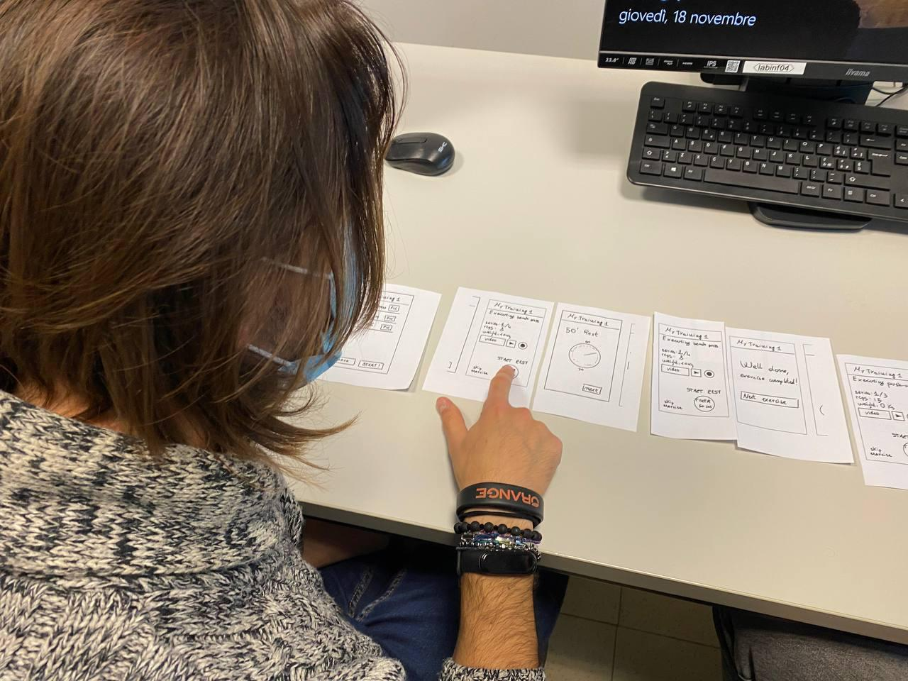

# Milestone 2: Prototyping and Heuristics - gymMe5

## Storyboards

The storyboard we created shows the user at the gym. He doesn't know which exercises to do and, in particular, he doesn't remember how to do them. The web app allows the user to check the training card that containes all the exercises he has to do. The user starts to train but he needs help for the execution of the exercise, luckly the app contains explanatory video for the exercise he's doing. The user performs the first repetition of the exercise and then he has to wait for the rest time, he can check it on the mobile application.
We chose this storyboard because it seemed the clearer way to show the tipical use of the application.
Its strenghts are that it's very simple and shows exactly the use of the application, a possibile weakness is that it may be unclear for a novice user gym that doesn't know what rest time is.
The identifieded user need is receiving support for and during the exercise execution: in this storyboard is showed how the user can consult which exercise he has to do, how he can execute it in the correct way and which is the timing for execution.

## Paper Prototypes

Our Prototypes are linked to the storyboard since they describe how the functionalities shown in the illustrations will be implemented.
In particular it is shown how the user can consult the daily training, how to watch the explainatory video and how to set the timer to count the resting time and the repetitions.
As described in the project description ([M1](../M1/Milestone1.md)), the two prototypes have been designed as mobile application so that they can be easily used in a gym. They aim to fulfill the user need of receiving support for and during the exercise execution. In detail for "supporting the user during the exercises" we mean two major activities:
- one related to the consultation of the training card: we want to give the user the possibility to "digitalize" his personal training card by creating and saving, on the application, the training card he needs. We do not want to only give the user the possibility to execute standard and preset trainings, but we want to give the more possibility of personalization as possible. As emerged during the interview with the personal trainer (see M1) workouts must be personalized for each person and must change over time. As a consequence, we want to allow the user to create workouts from scratch and to edit them at any time. This preliminary phase of creation in necessary for the second type of support we want to give to the user.
- one related to the exercises execution: knowing the training card, we want to follow the user during it's execution, giving a user-friendly interface that counts series, repetitions and resting time for the user, leaving him free to focus on the right execution and avoiding the risk of loosing the count.

The first prototype provides the possibility to schedule the trainings over time, thus it shows in the homepage a calendar that displays the scheduled training for each day. Furthermore it allows the user to visualize the progress of the training card currently in execution by displaying an overview of the exercises completed and the ones still to do.
The second prototype, instead, shows in the hompage all the training cards created that can be selected and executed without the consultation of the calendar. In this prototype, once the training is selected, the user is guided exercise after exercise in the order they have been inserted at creation time with no overall view.

## Prototype 1 Flow
__Note__ : the second panel and the tenth panel are shown when the user clicks on a day of the calendar. "6 NOV" from the second panel has been chosen to visualize the page showed by clicking on a day with a workout within. "7 NOV" from the tenth panel has been chosen to visualize the page showed by clicking on a day without a workout within. When executing the evaluations, the correct page was showed after user's click on a given day.

## Prototype 2 Flow

## Heuristic Evaluation

For the Heuristic evaluation we printed our two paper prototypes and a handmade paper phone mockup to show the current display of the application. One of our group played the role of the computer and moved the mockup over different cards after almost atevery "click". Instead another one played the role of the facilitator which introduced the evaluator to the context of the application and explained some basic features. He/she also gave help during the evaluation and took notes of some unexpected requests or comments of the evaluator. For prototype 1 and 2 we alternated the roles so that two of us played both the computer and the facilitator during the whole evaluation.

## Evaluations

The group which examined and evalued our prototypes was the one developing the Diabetes-simplifier application. In particular, two members of this group examined, separately, both our prototypes. At the end of the laboratory they both gave us two personal reports (one per prototype) with all the issues they had found. 
At the beginning of each evaluation we set two goals for the evaluators in order to explore the whole application. The first goal consisted in executing a workout, the second goal consisted in creating a workout.
The execution of the first task (execution of a workout) was very intuitive for the evaluators and took less time then the second one. For this reason, we think that the creation part of the application must be simplier and clearer. The evaluators, as expected, found more issues in the creation part, and less in the execution one.

Their personal evaluations are available [here](https://docs.google.com/document/d/1oF9-FDwre_qPOZJAsdUejN9aHiaTFErMHQIh62tsl_c/edit?usp=sharing).

The next day they provided us with a global report, made up by all the Heuristic issues they gave the most importance to.

Their evaluation for prototype 1:

| Issue | Heuristc | Description | Rating |
|:---------:|:--------:|:-----------:|:------:|
| 1 | H5 |      Lack of clarity during the creation of a new exercise (mandatory fields not specified) | 2 |
| 2 | H5 |      Missing labels for the correct insert of exercise informations (series, repetitions), easy to go wrong, no prevention| 3 |
| 3 | NH |      Reduced possibility of training personalization, it would be better if each series had its own characteristics (weight, rest time, repetitions) | 3 |
| 4 | H1 - H6 | No information of current exercise name when clicking "info" | 1 |
| 5 | H5-H9 |   Lack of possibility to recover from wrong click (when a timer is started by mistake it can not be resetted) | 3 |
| 6 | H10 |     Lack of clarity during the exercise creation, "repeat" button should be explained | 2 |
| 7 |  H9 |     No possibility to edit or remove a workout on a given day | 3 |
| 8 | H5-H9 |   Missing recovery from wrong click on "end workout" | 4 |

Their evaluation for prototype 2:

| Issue | Heuristc | Description | Rating |
|:---------:|:--------:|:-----------:|:------:|
| 1 | H4 | Lack of clarity during the creation of a new exercise (he doesn't understand if the description field is precompiled or not) | 2 |
| 2 | NH | Reduced possibility of training personalization, it would be better if each series had its own characteristics (weight, rest time, repetitions) | 3 |
| 3 | H3 | Lack of possibility to go back to a main training page during the session that means no possibility to avoid an exercise or to change exercise during execution (weigth, rest time, repetitions) | 2 |
| 4 | H4 | Missing default values for series, rep, weights etc. when the user adds an exercise, chosen among those yet created | 1 |
| 5 | H1 | While creating a new training the name inserted by the user should be shown at the top of the display instead of "training creator", so he/she can easily understand what he/she is doing | 2 |
| 6 | H1 | In training creator the word "create" inside the button is confusing: "create training" could be better to make the user understand that he's creating the whole training card by clicking it | 2 |

The evaluation made us realize how important it is to always give the possibility to recover from misclick, we tried to make our prototypes simple and intuitive, but in some cases (emerged in issues 5-8, prototype 1) we forgot to add the possibility to cancel an action. We give importance to this topic, the final application must be totally misclick-safe. The advice about adding more possibility of personalization (issue 3, prototype 1; issue 2, prototype 2) is a really interesting one, the evaluator was expecting to be able to personalize each series of an exercise, and was really surprised when he understood he could not. In order to create an intuitive application, we must add this possibility. The issues about missing labels, or buttons' names will surely be fixed, but we give them less importance because most of them are due to inaccuracies in creating the paper prototypes.

After reading their report, we decided to make some changes in order to solve the issues they had found. We took the decision to mix our prototypes as they both had some peculiar features that were really appreciated during the evaluations and we wanted to keep them in the final project. In particular, we have decided to keep the structure of the prototype 1 and to add in the homepage the list of the created trainings and the create button (both taken from prototype 2). During the evaluations we also focused on how the evaluators interacted with the application, and we noticed that the calendar feature of prototype 1 generated some uncertainty (difficulty to immediately understand what to do). For this reason, we decided to delete the calendar feature and choose, for the homepage, the one used in prototype 2. The evaluators took time to execute the task related to the creation of the workout. For this reason we decided to simplify this task by deleting the possibility to create an exercise from scratch. The user will have the possibility to add an exercise to a training by chosing from the set of existing exercises and not by creating a new one.

List of other changes to implement:

- Addition of asterisks next to the mandatory fields during the training creation (As pointed out in Evaluation 1 - Issue 1);
- Addition of labels to specify series and repetition fields (As pointed out in Evaluation for prototype 1 - Issue 2)
- Increase training peronalization by giving the possibility to specify the amount of repetitions, weights and rest time
   for each serie of an exercise (As pointed out in Evaluation for prototype 1 - Issue 3);
- Possibility to reset the timer (As pointed out in Evaluation for prototype 1 - Issue 5);
- Possibility recovery from wrong click on "end workout" through a confirmation message after the click (As pointed out in Evaluation for prototype 1 - Issue 8);
