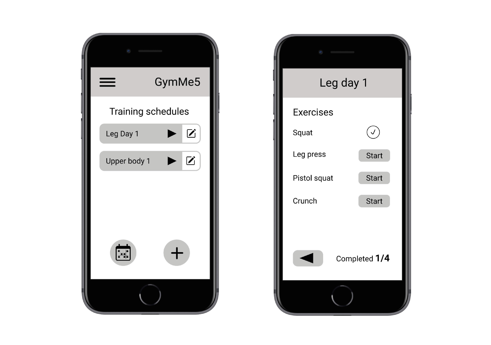

# Milestone 3: Wireframe - GymMe5

## Wireframe

<!---
Add here the link to the PDF documents that represent your two wireframes (or embed the PNG images). Briefly explain which tool you used to create both wireframes, any relevant decision you took starting from the outcome of M2, and why the second page is significant for your project.
-->

To create our wireframe we decided to use [Figma](https://www.figma.com/). The two pages represent rispectively the main page and the workout execution page. As discussed in [M2](../M2/Milestone2.md) the main page shows to the user the list of existing workouts (feature taken from prototype 2), giving the possibility either to modify or execute them. 

The second page is consulted while executing a workout, it allows the user to check the training schedule and to execute the contained exercises one by one, freely chosing the order of execution and keeping track of which exercises are left (feature taken from prototype 1). After the execution of each of the exercises, the user will be redirected here. This page is significant to our project as it will be one of the most consulted pages. Futhermore, this page implies a series of structural choices (better described in M2's final paragraph) which make the application an hybrid between our first prototype and our second one.

To help us during the programming phase, we decided to use Figma to create a [complete version of the final application's interfaces](https://www.figma.com/proto/rsiG26q1xWgeC1fZTVOKnA/Prototype1?node-id=1%3A2&scaling=scale-down&page-id=0%3A1&starting-point-node-id=1%3A2&show-proto-sidebar=1), to better visualize each element and page that must be implemented.