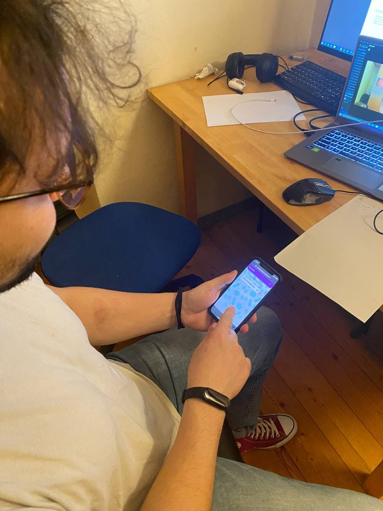
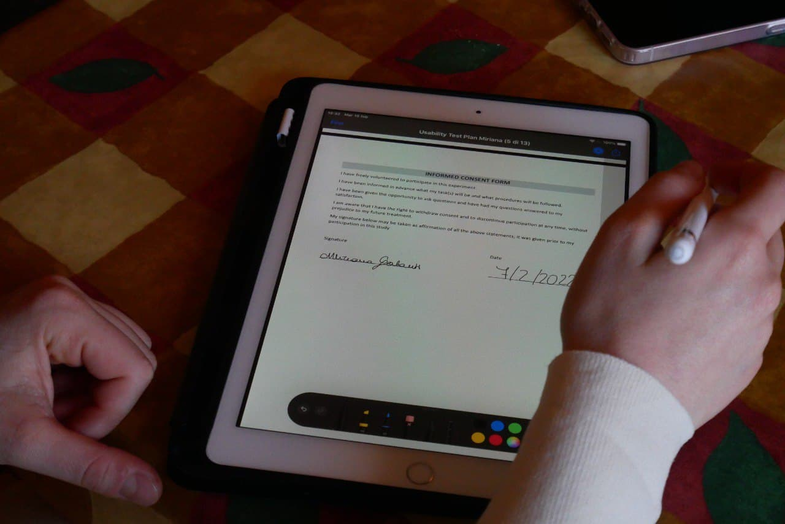
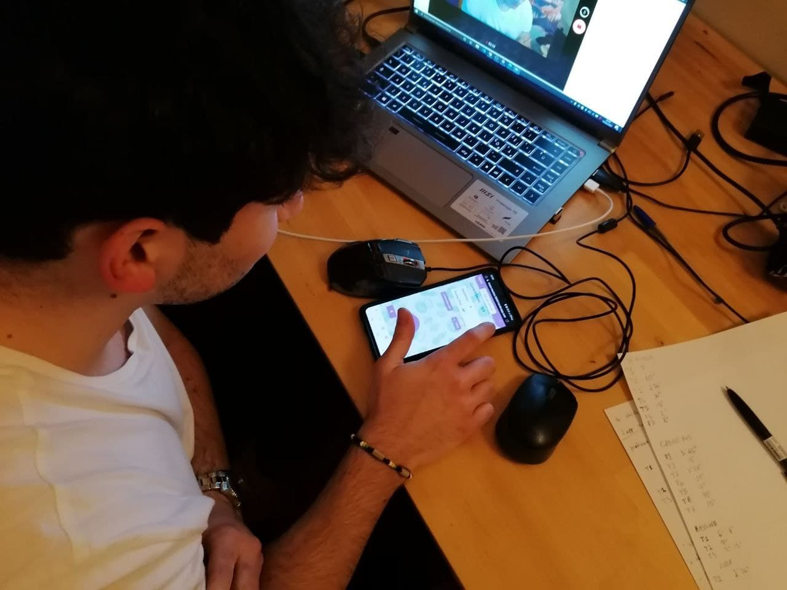
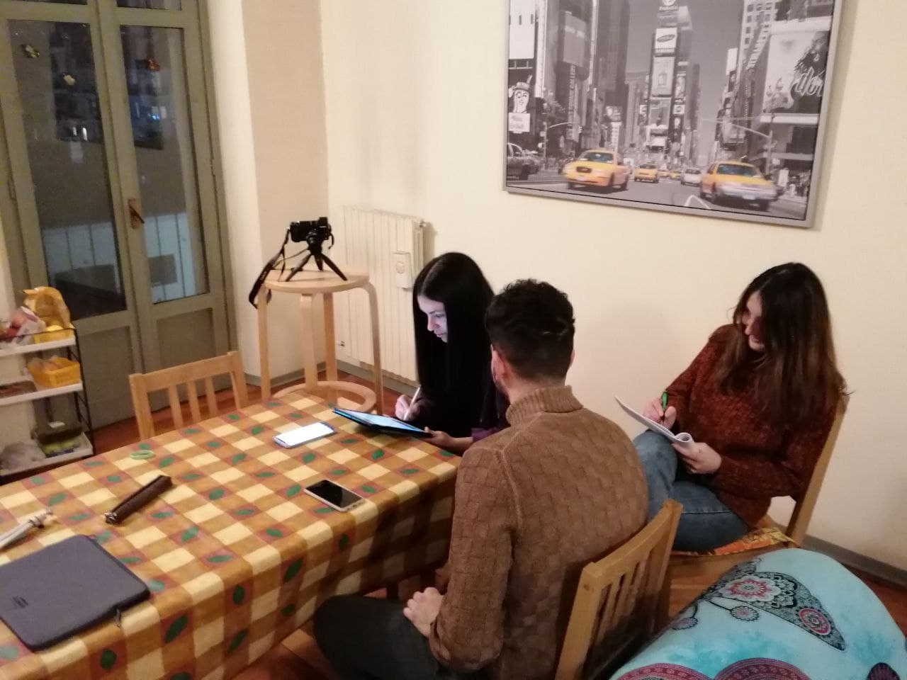
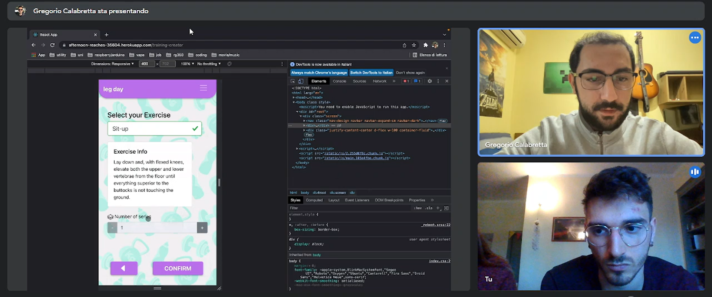
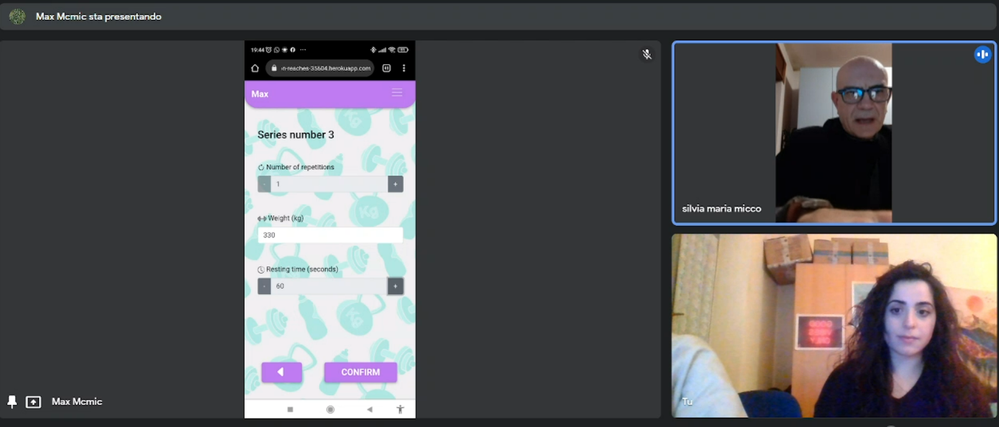

# Milestone 4: Usability Testing - GymMe5

## Overview and Script

**The Usability Test Plan, the filled forms and questionnaires and the other documents used before and during the evaluations can be found [here](https://drive.google.com/drive/folders/1jJEUpRWbPSzM75kJBptWHKBPCjmVFcxK?usp=sharing).**

The Usability Testing Protocol we wrote down contains a series of documents that we used before and during the evaluations such as the screener, the post task questionnaire (SEQ), the post test questionnaire (SUS), the consent form and the debriefing interview.

### *Usability Testing Protocol choices explaination*
We set a series of tasks introducing a scenario and an objective for the user. We wanted to make the user explore the whole application, but we also needed to choose some plausible scenarios and goals for the user. We came to the conclusion that the seven tasks we chose were the most suitable for our needs, as they allow the user to create, modify and perform a workout, exploring the entire set of possibilities of GymMe5. We set the estimated time necessary to complete each task.

We decided to use a questionnaire at the end of the test (SUS) and questionnaires at the end of each task (SEQ).
We also prepared a short debriefing sessions, with a simple interview. We ended up having a lot of useful data to analyze.

### *Screening*
To find out some volunteers for our testing, we went to the same two gyms we chose for the observation in [M1](../M1/Milestone1.md), we prepared a Screener document that helped us during this preliminar phase. We aimed to find six gym users (even mix of females and males), between 18 and 65 years old. We managed to find 2 girls (Benedetta and Miriana, approximately 25 years old), 3 boys (Gregorio, Luca and Francesco, also about 25 years old), and a man, Massimo, about 60 years old.

### *Test settings and roles*
We conducted the evaluations between 7 and 9 February and we prepared ourselves by testing the Script on some of our close friends until we felt confident in what we were going to do during the actual testing.
To obtain the most data we could, we positioned two cameras, one framed the user's hands holding the smartphone with our application; one framed the user's face, to better analyze their facial expression. 
One member of our group had to get the two cameras to work properly, turning them on and switching shots as needed.
One of us had to take notes during the whole testing, keeping track of the user's relevant reaction, actions and writing down what the user said while thinking aloud.
Two members of our group played the role of facilitators, they took turns, in order to have one of them as the facilitator and one to start e set the stopwatch (to monitor the time necessary to perform the tasks).

## Results and List of Changes

### *Quantitative metrics*
- **time to execute the task:**  most of the users spent much less time then what we thought they would. Also, they were slowed down by the fact that they had to think-aloud. For this reason we can deduce that the application do not take much time to be learned and understood, even the tasks that were more problematic did not take more than 4 minutes to be completed.

- **number of users able to complete each task:** one of the users did not manage to complete the task T6 (*Edit leg day training’s first exercise by increasing series number*) alone, and the facilitator had to explain the situation. She stopped because she did not understand the button "confirm" in the edit workout's name page.

- **number of attempts required to complete each task:** for T1 (*Execute a specific workout.*), all the users pressed the "START REST TIMER" button thinking it would have made the exercise start. After that they all went back and read the button again; with some uncertainty they all managed to complete the task at the second attempt. Task T6 required 2 attempts by two of the users. In particular, one of them found some problems understanding that the series of an exercise had to be edited one by one and one did not understand, at first, that the button "confirm" inside the edit workout's name page would have led to edit the exercises contained into the workout.

- **post task questionnaire:** we obtained an acceptable score, as all the users did not rate the tasks as difficult. One users out of six gave the tasks T1, T3 and T6 a 3 on a 7-point Likert scale, giving the only three scores under the average. User's answers were also very useful, as they gave us many ideas to work on and they clearly pointed out all the problems they found (he analysis of those questionnaires can be found in the paragraph *"Qualitative metrics and general results"*).

- **post test questionnaire scores:**
    - Benedetta:    90
    - Francesco:    82,5
    - Gregorio:     95
    - Luca:         95
    - Massimo:      82,5
    - Miriana       97,5 
    
    The scores are definetly positive, expecially considering that 68 is above average. Those extremely positive scores makes difficult to extrapolate some information about what to enhance in our application. However, analyzing the questionnaire we found out that the affirmation number 3 (*I thought the system was easy to use*) was, globally, the one with the lowest score. We deduced that our application must became clearer and simpler. All the users strongly disagreed with the affirmation number 10 (*I needed to learn a lot of things before I could get going with this system.*). This makes us think that our application is calibrated for the knowledge of an average gym user and that the language we used is understandable for our target users. 

### *Qualitative metrics and general results*

The notes taken during the test, the think-aloud process and the video captures really helped us finding some issues in our application. 
We recognized some evident patterns in the behaviour of the users that we did not expect. 

Their final interviews, their actions during the test, their facial expression and their SEQ questionnaire were all very similar. Most of the users started to look uncertain and confused:
- during the workout execution: they all pressed the button "START REST TIMER" thinking it would have made the exercise start. No one noticed the notification, in the same page, saying "Start your exercise!". 
- during the workout edit: most of the users, reading the button "confirm" inside the edit workout's name page, seemed disorientated and stopped talking for a moment. Even if they did not pointed it out during the questionnaire or the interviews, the video captures show their hesitation on pressing the button. 
- during the workout edit and creation: all the users did not read the words "Series number 1" when editing the series of an exercise and thought that the compiled fields would have been set for all the series of that exercise. After pressing "confirm" they all seemed a bit concerned to see a page extremely similar to the previous one but yet to be compiled. One user also asked "What is happening?", demonstrating that clearly there is some major problem to be fixed. Then, when the users read "Series number 2" they managed to understand what was actually happening.

The test made clear that our application has three severe pain points and a series of secondary ones. The three problems described above must be fixed because they lead to error and confusion. 

<u>They emerged from: </u>
- the SEQ questionnaires: no one gave 7 points to the first task and everyone proposed an idea to solve the fact that the start on "START REST TIMER" brings confusion. Also, many of the users gave low score to the third and to the sixth task and pointed out that they had problems understanding that thay had to fill the fields for each seres. 
- the interviews: all the users said that the editing part was the most counterintuitive. Two of them said that they felt overwhelmed or confused in the execution part, seeing "START REST TIMER".
- the video captures

The test made we also realize that some tasks were really easy to complete for the users. They all were really fast at finding an exercise's information (video and description) and at navigating back from the execution workout to the home page. They found those parts very intuitive as they said during the debriefing interview and in the SEQ questionnaires. For this reason we are not going to modify those parts of our application, because it is clear that they do not lead to any problem or uncertainty.

### List of changes

We chose to implement three important changes on the GymMe5 application to solve the three issues exposed in the previous paragraph.

- To fix the problem concerning the "START REST TIMER" button, we decided to substitute the button with a "START EXERCISE" button, that, when pressed, makes the "START REST TIMER" button appear.

- To fix the problem generated by the presence of the "confirm" button inside the "edit workout's name" page, we decided to change "confirm" with "next". In this way, the users will not be lead to think that the editing phase will end by pressing the button.

- To fix the problem about the difficulty to understand that the series must be edited/created one by one, we decided to insert a progress bar (more visible that the titles "Series number X") that clearly shows the progression on the exercise editing/creation in terms of series edited/created. 

Another minor change to implement and how it emerged during the test:

- the issue pointed out by Massimo, during the post task questionnaire for the task 5 showed us that we were not being consistent in our application. For this reason, we decided to fix the problem by uniformating the language and using the word "workout" instead of "training". 

### Relevant video clip from the Usability Testing

[Video "start rest timer" button problem](https://www.youtube.com/watch?v=wTmMe11QsCM&list=PLjWNWKVI6vRt0Zht2hbrTHx2o6sa4XtKB) : after pressing the button, the user was visibly confused. She also stopped to say "I did something wrong...". After a moment, she stopped the timer, went back, read the button and understood. She said "Now i'm supposed to execute the exercise, and then press the button" but her voice showed she was uncertain.

[Video "continue" button problem](https://www.youtube.com/watch?v=Wn2I4sd3gr0&list=PLjWNWKVI6vRt0Zht2hbrTHx2o6sa4XtKB&index=3) : the user had to modify a workout increasing the series number of the first exercise contained in the workout. She blocked when she saw the button "confirm". The clip shows how she started looking uncertain. The facilitator had to explain her the situation, so this task was not completed successfully by the user.

[Video editing/creating series problem]( https://www.youtube.com/watch?v=FgKrGMs3nSA&list=PLjWNWKVI6vRt0Zht2hbrTHx2o6sa4XtKB&index=3 ) : the user was trying to create a new workout (we gave her the sample of a paper workout, contained into the Usability Test Plan) and when she created the first series and pressed "confirm" she stopped, it can be seen how she immediately understands the situation when she reads "Series number 2". It's clear that this writing is not enough visible. 

### Pictures from the Usability Testing

